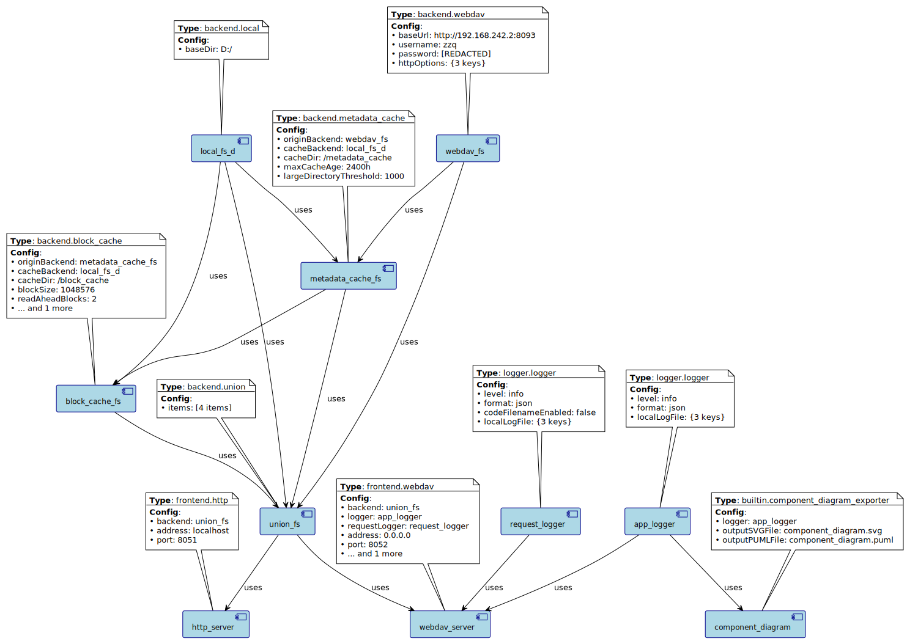

# VFS Framework

一个基于 Dart 的虚拟文件系统框架，提供统一的文件系统抽象层，支持多种后端存储和前端访问方式。

## 🌟 项目概述

VFS Framework 是一个受 [rclone](https://rclone.org/) 和 [Alist](https://alist.nn.ci/) 启发的虚拟文件系统框架。它提供了一个统一的 API 来访问不同的存储后端，并支持多种前端访问方式。该框架采用插件化架构，易于扩展和定制。

### 核心特性

- 🔌 **插件化架构**：支持多种存储后端和前端
- 🌐 **统一 API**：为所有存储后端提供一致的文件系统接口
- 🔀 **联合文件系统**：支持将多个文件系统合并为一个逻辑视图
- 🎯 **别名文件系统**：支持将子目录作为独立的文件系统根目录
- 🚀 **高性能**：异步操作和流式处理
- 🔧 **蓝图编排**：声明式组件配置和依赖管理

## 📁 支持的文件系统后端

### 当前支持

- **LocalFileSystem** - 本地文件系统
- **MemoryFileSystem** - 内存文件系统（用于测试和缓存）
- **WebDAVFileSystem** - WebDAV 协议支持
- **UnionFileSystem** - 联合文件系统（合并多个后端）
- **AliasFileSystem** - 别名文件系统（子目录映射）

### 计划支持

- S3 兼容存储
- FTP/SFTP
- Google Drive
- OneDrive
- 阿里云 OSS
- 腾讯云 COS

## 🌐 支持的前端接口

### HTTP 服务器

- **HTTP 服务器** - RESTful API 和 Web 界面
  - 文件浏览和下载
  - 目录列表
  - 中文文件名支持

### 计划中的前端

- WebDAV 服务器
- FTP 服务器
- gRPC API
- 命令行工具

## ⚙️ 蓝图编排引擎

VFS Framework 包含一个强大的蓝图编排引擎，用于声明式配置和管理组件。编排引擎提供：

- **依赖注入**：自动解析和注入组件依赖
- **生命周期管理**：组件的创建、配置和运行
- **配置驱动**：通过 YAML/JSON 配置文件定义整个系统

### 编排引擎示例

#### 配置文件 (`config.yaml`)

[config.yaml](bin/config.yaml)

#### 运行启动

```bash
cd bin
dart run vfs_framework.dart
```

将得到如下编排可视化图：


访问 [http://localhost:8080](http://localhost:8080) 查看文件系统内容。
